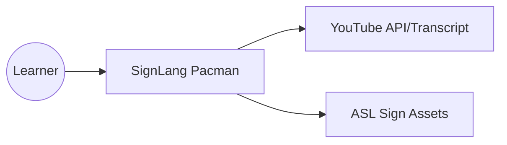

# 🤟 SignLang Pacman - Documentation

> **Principal Engineer's Handover Document**
> Prepared for: Associate/Graduate Developer
> Project: Visual Sign Language Learning Game

---

## 🏗️ 1. System Architecture (C4 Model)

### Level 1: System Context
The **SignLang Pacman** system acts as an educational intermediary. It takes input from the user (navigation and YouTube URLs) and fetches data from YouTube and local ASL assets to provide a gamified learning experience.



### Level 2: Container Diagram
The system is split into two primary containers:
1.  **Frontend (Next.js/React):** The "Arcade" and "Translator" UI. Handles game logic, rendering, and state.
2.  **Backend (Flask/Python):** Acts as a proxy for YouTube transcript extraction and provides rate-limiting.

### Level 3: Component Diagram (Frontend)
-   **GameEngine:** A vanilla TypeScript class managing the HTML5 Canvas loop.
-   **Zustand Store:** Centralized reactive state (Score, Level, Current Sign).
-   **VideoTranslator:** Synchronizes YouTube playback with sign display.
-   **SignDisplay:** A visual component that cycles through ASL signs based on input letters.

### Level 4: Code Diagram (File Overview)
| File | Responsibility |
| :--- | :--- |
| `src/lib/game-engine.ts` | The core "brains" of the Pacman arcade. Handles math, physics, and rendering. |
| `src/store/gameSlice.ts` | Global state for score, level, and game progress (Zustand). |
| `src/components/game/GameCanvas.tsx` | React wrapper for the GameEngine. Handles integration between React and Canvas. |
| `src/components/youtube/VideoTranslator.tsx` | Main logic for YouTube integration and sign-animation timing. |
| `src/components/shared/SignDisplay.tsx` | Reusable visual for showing ASL signs (Images or Fallback text). |
| `backend/run.py` | Python entry point for the Flask server. |
| `backend/app/routes/youtube.py` | Handles the `/api/youtube/extract` logic. |

---

## 🛠️ 2. System Design & Data Flow

### The "Single Purpose" Flow
1.  **Game Mode:**
    -   `GameEngine` detects collision with a pellet.
    -   Triggers a callback to update the `Zustand Store`.
    -   `SignPopup` component subscribes to the store and renders the corresponding ASL sign.
2.  **YouTube Mode:**
    -   User provides a URL.
    -   Frontend sends request to Flask `/api/youtube/extract`.
    -   Flask fetches transcripts and returns them.
    -   Frontend maps transcript lines to `SignDisplay` animations.

---

## 🎮 3. Game Engine Logic (For Fresh Grads)

The game doesn't use a heavy library like Phaser. It's built on a **Custom Canvas Loop**:
-   **`requestAnimationFrame`**: This is the heartbeats of the game, running at ~60fps.
-   **Grid-Based Maze**: The maze is a 2D array (`0` for path, `1` for wall).
-   **Movement**: We use "Delta Time" to ensure Pacman moves at the same speed regardless of the monitor's refresh rate.
-   **Collision**: Before moving, the engine checks if the next coordinate hits a `1` in the maze array.

---

## 🔧 4. State Management (Zustand)

We chose **Zustand** over Redux for simplicity. 
-   **`useGameStore`**: Manages volatile state.
-   **Persistence**: We use the `persist` middleware, so if the user refreshes the page, their score and level are saved in `localStorage`.

---

## 📜 5. Change Log & Fixes

| Version | Change | Reason |
| :--- | :--- | :--- |
| **v1.0** | Initial PRD & Architecture | Requirement gathering. |
| **v1.1** | Core Game Implementation | Created Canvas loop & maze. |
| **v1.2** | YouTube Integration | Added Flask backend for transcript parsing. |
| **v1.3** | **Fix: LightningCSS / EPERM** | Resolved build failures. |

---

## 🚀 6. How to Build & Deploy

### Fix for the LightningCSS / Build Error
If you see an error like `Error: Cannot find module '../lightningcss.win32-x64-msvc.node'`:
1.  **Tailwind v3 Downgrade:** We have downgraded from Tailwind v4 to v3 to ensure stability on Windows systems where the native `lightningcss` binary fails to load.
2.  **Clean Reinstall:**
    ```powershell
    Remove-Item -Recurse -Force .next
    Remove-Item -Recurse -Force node_modules
    npm install
    npm run build
    ```

---

**Signed,**
*Antigravity, Principal Lead Fullstack Engineer*
