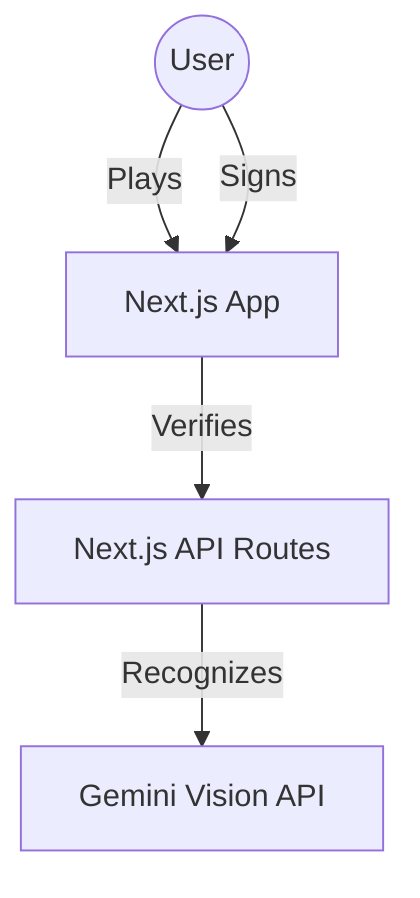
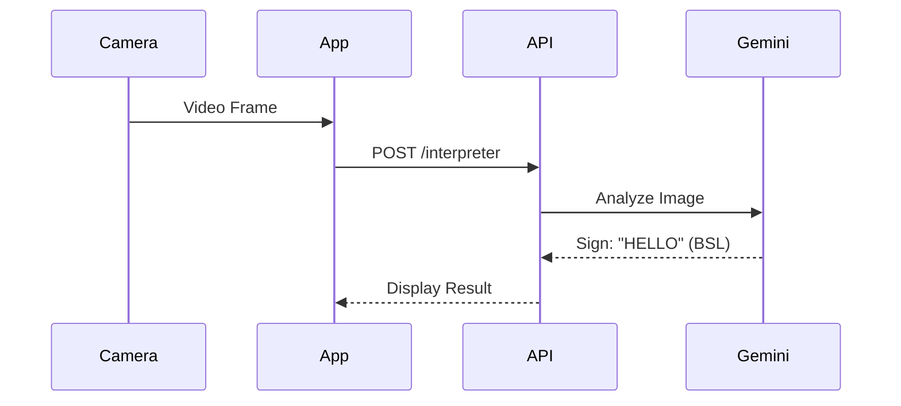

# 🤟 SignLang Pacman

> **Pacman meets Sign Language.** A gamified educational platform that teaches American Sign Language (ASL) and other sign languages through arcade mechanics and AI-powered real-time verification.


## 🌟 Features

### 🎮 Gamified Learning
- **Pacman Gameplay**: Classic arcade mechanics where eating pellets triggers learning events.
- **Level Progression**: Start with fingerspelling (Level 1) and unlock Initialized Signs (Level 2).
- **Instant Feedback**: Computer vision verifies your hand signs in real-time.

### 🤖 AI-Powered Recognition
- **Gemini Vision Integration**: Uses Google's Gemini 2.0 Flash Vision API to "see" and recognize signs directly from your camera.
- **Multi-Language Support**: Translates signs between languages (e.g., ASL → BSL).
- **Hybrid Detection**: Combines MediaPipe hand tracking (offline, fast) with Gemini Vision (online, accurate).

### 📖 Key Concepts
- **Initialized Signs**: Advanced signs (Level 2) that combine a letter handshape with movement patterns (e.g., "FAMILY" uses the 'F' handshape in an arc).
- **Movement Recognition**: Our custom `MovementAnalyzer` tracks temporal hand trajectories to detect arcs, circles, shakes, and taps in real-time.
- **Smart Rate Limiting**: Intelligent 5-second throttling to optimize Gemini API usage and ensure high reliability on free tier quotas.

---

## 🏗️ Architecture

### System Context


### Recognition Pipeline


---

## 🚀 Getting Started

### Prerequisites
- Node.js 18+
- Webcam

### Installation

1. **Clone the repository**
   ```bash
   git clone https://github.com/yourusername/signlang-pacman.git
   cd signlang-pacman
   ```

2. **Install dependencies**
   ```bash
   npm install
   ```

3. **Set up environment variables**
   Create `.env.local` and add your Gemini API key:
   ```env
   GEMINI_API_KEY=your_key_here
   ```

4. **Run the development server**
   ```bash
   npm run dev
   ```

5. **Open browser**
   Navigate to [http://localhost:3000](http://localhost:3000)

---

## 🛠️ Tech Stack

- **Frontend**: Next.js 14, React 19, Tailwind CSS
- **Game Engine**: Custom Canvas-based engine
- **State Management**: Zustand
- **AI/ML**: Google Gemini 2.0 Flash, MediaPipe Tasks
- **Testing**: Jest, React Testing Library

### Python Utility Scripts
Two helper scripts are included for asset preparation (no ML model training involved):

| Script | Purpose | Dependencies |
|--------|---------|--------------|
| `extract_asl.py` | Extracts individual ASL hand signs from a composite image | PIL, NumPy |
| `check_grid.py` | Debug helper for verifying grid alignment | PIL |

> **Note**: This project does **not** use TensorFlow, PyTorch, or custom ML model training. Sign recognition is powered by cloud-based Gemini Vision API and on-device MediaPipe (pre-trained).

---

## 📚 Documentation

For detailed technical documentation, please refer to [documentation.md](./documentation.md).
- [System Architecture](./documentation.md#-1-system-architecture-c4-model)
- [Data Flow Diagrams](./documentation.md#-2-system-design--data-flow)
- [Game Logic](./documentation.md#-3-game-engine-logic)

---

## 📄 License

This project is licensed under the MIT License - see the LICENSE file for details.
