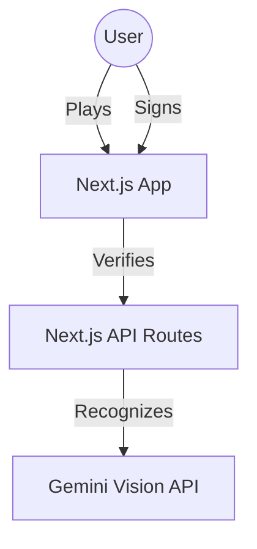
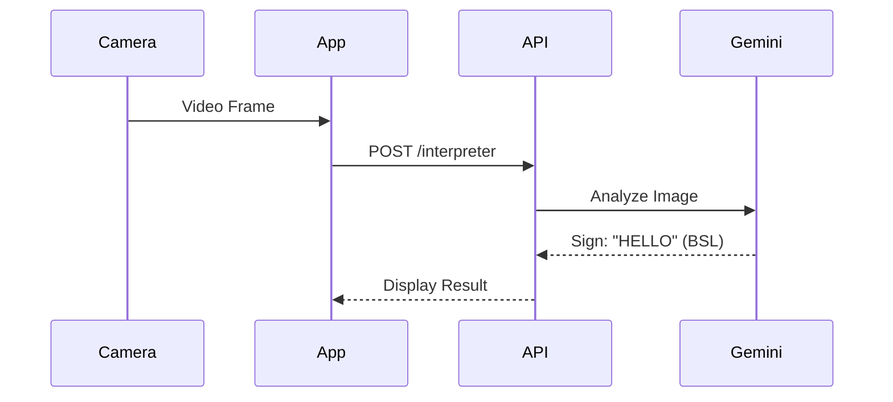

# 🤟 SignLang Pacman

> **Pacman meets Sign Language.** A gamified educational platform that teaches American Sign Language (ASL) and other sign languages through arcade mechanics and AI-powered real-time verification.


## 🌟 Features

### 🎮 Gamified Learning
- **Pacman Gameplay**: Classic arcade mechanics where eating pellets triggers learning events.
- **Level Progression**: Start with fingerspelling (Level 1) and unlock Initialized Signs (Level 2).
- **Instant Feedback**: Computer vision verifies your hand signs in real-time.

### 🤖 AI-Powered SignBridge
- **Linguistic Reasoning Engine**: Powered by **Gemini 2.5 Flash**, this feature goes beyond simple classification. It "watches" a 5-second video of you signing to understand temporal movement.
- **Polyglot Translation**: Translates **initialized words** (Level 2) and **full sentences** (e.g., "HELLO TALL MAN") into English gloss and other sign languages.
- **Syntax Parsing**: Diagnostically identifies Subject, Verb, Object structures in your signing.
- **Hybrid Detection**: Combines MediaPipe (fast/offline) for game controls with Gemini (deep reasoning) for translation.
- **Quota Protection**: Smart 10s cooldowns and frame optimization to respect API limits.

---

## 🏗️ Architecture

### System Context


### Recognition Pipeline


---

## 🚀 Getting Started

### Prerequisites
- Node.js 18+
- Webcam

### Installation

1. **Clone the repository**
   ```bash
   git clone https://github.com/yourusername/signlang-pacman.git
   cd signlang-pacman
   ```

2. **Install dependencies**
   ```bash
   npm install
   ```

3. **Set up environment variables**
   Create `.env.local` and add your Gemini API key:
   ```env
   GEMINI_API_KEY=your_key_here
   ```

4. **Run the development server**
   ```bash
   npm run dev
   ```

5. **Open browser**
   Navigate to [http://localhost:3000](http://localhost:3000)

---

## 🛠️ Tech Stack

- **Frontend**: Next.js 14, React 19, Tailwind CSS
- **Game Engine**: Custom Canvas-based engine
- **State Management**: Zustand
- **AI/ML**: Google Gemini 2.5 Flash, MediaPipe Tasks
- **Testing**: Jest, React Testing Library

### Python Utility Scripts
Two helper scripts are included for asset preparation (no ML model training involved):

| Script | Purpose | Dependencies |
|--------|---------|--------------|
| `extract_asl.py` | Extracts individual ASL hand signs from a composite image | PIL, NumPy |
| `check_grid.py` | Debug helper for verifying grid alignment | PIL |

> **Note**: This project does **not** use TensorFlow, PyTorch, or custom ML model training. Sign recognition is powered by cloud-based Gemini Vision API and on-device MediaPipe (pre-trained).

---

## 📚 Documentation

For detailed technical documentation, please refer to [documentation.md](./documentation.md).
- [System Architecture](./documentation.md#-1-system-architecture-c4-model)
- [Data Flow Diagrams](./documentation.md#-2-system-design--data-flow)
- [Game Logic](./documentation.md#-3-game-engine-logic)

---

## 📄 License

This project is licensed under the MIT License - see the LICENSE file for details.
